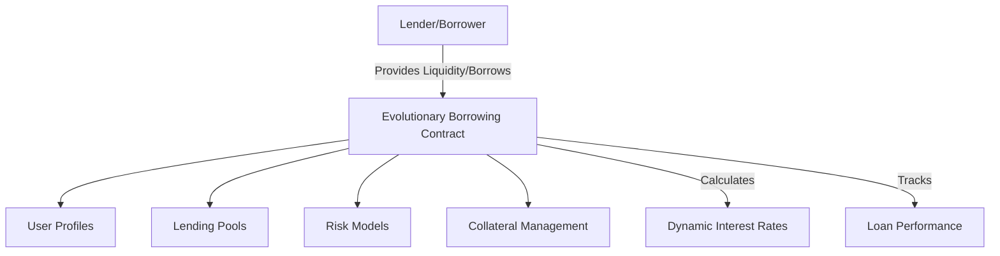

# Evolutionary Borrowing

A decentralized DeFi protocol introducing dynamic and adaptive lending mechanisms powered by smart contract innovation.

## Overview

Evolutionary Borrowing is a blockchain-based lending platform that enables flexible, intelligent borrowing strategies through adaptive financial mechanisms:
- Dynamic interest rates
- Risk-adjusted lending pools
- Algorithmic credit scoring
- Automated collateral management

The platform features:
- Adaptive lending parameters
- Real-time risk assessment
- Decentralized credit evaluation
- Automated liquidation strategies
- Privacy-preserving financial interactions

## Architecture

The Evolutionary Borrowing system is built around a core smart contract that manages lending dynamics, risk modeling, and financial interactions.



The contract implements several key data structures:
- `user-profiles`: Tracks user financial history and credit metrics
- `lending-pools`: Manages liquidity across different risk categories
- `loan-positions`: Tracks individual loan details and performance
- `risk-parameters`: Defines adaptive lending criteria
- `collateral-records`: Monitors and manages user collateralization

## Contract Documentation

### Core Functionality

#### User Management
- User profiles dynamically generated on first interaction
- Tracks financial history, credit scores, and loan performance
- Privacy-preserving design with principal-based identification

#### Lending Mechanics
- Supports multiple collateral types
- Dynamic interest rate calculations
- Configurable loan-to-value ratios
- Automated liquidation triggers
- Risk-adjusted lending parameters

#### Risk Management
Three-tier risk assessment:
1. Collateralization ratio
2. Historical loan performance
3. Market volatility indicators

## Getting Started

### Prerequisites
- Clarinet
- Stacks wallet for testing

### Basic Usage

1. Create a lending position:
```clarity
(contract-call? .borrowing-evolution create-loan-position 
    stx-collateral   ;; Collateral amount
    u5000            ;; Borrow amount
    u2               ;; Loan duration (months)
)
```

2. Adjust loan parameters:
```clarity
(contract-call? .borrowing-evolution update-loan-parameters 
    loan-id          ;; Specific loan identifier
    new-parameters)  ;; Updated risk/rate configuration
```

## Function Reference

### Public Functions

#### `create-loan-position`
Initiates a new lending position
```clarity
(create-loan-position collateral-amount borrow-amount loan-duration)
```

#### `update-loan-parameters`
Dynamically adjusts loan terms
```clarity
(update-loan-parameters loan-id new-parameters)
```

#### `liquidate-position`
Triggers automated liquidation
```clarity
(liquidate-position loan-id)
```

### Read-Only Functions

#### `get-user-credit-score`
```clarity
(get-user-credit-score user) ;; Returns comprehensive credit evaluation
```

#### `calculate-dynamic-rate`
```clarity
(calculate-dynamic-rate loan-details) ;; Computes adaptive interest rate
```

## Development

### Testing
1. Clone the repository
2. Install Clarinet
3. Run tests:
```bash
clarinet test
```

### Local Development
1. Start Clarinet console:
```bash
clarinet console
```
2. Initialize lending parameters:
```clarity
(contract-call? .borrowing-evolution initialize-lending-protocol)
```

## Security Considerations

### Financial Safety
- Robust collateralization mechanisms
- Automated risk assessment
- Immutable transaction history
- Decentralized liquidation protocols

### Limitations
- Loan positions subject to market volatility
- Collateral value fluctuations
- Dynamic interest rate adjustments

### Best Practices
- Maintain healthy collateralization ratios
- Diversify lending positions
- Continuously monitor risk parameters
- Understand protocol mechanics before participating